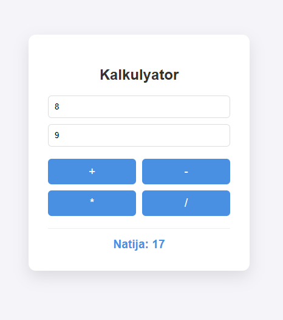

# 🧮 JavaScript Kalkulyator Loyihasi

Ushbu loyiha **27-Hafta (Javascript Asoslari)** topshirig'i doirasida tayyorlangan. Foydalanuvchi ikkita son kiritishi va ular ustida 4 ta asosiy matematik amalni bajarishi mumkin.

## 🚀 Loyiha tavsifi
Loyihaning asosiy maqsadi JavaScript-da o'zgaruvchilar bilan ishlash, string ma'lumot turlarini songa o'girish va SASS (SCSS) orqali zamonaviy dizayn yaratishni o'rganishdir.

### 🛠 Ishlatilgan texnologiyalar:
* **HTML5** - Sahifa strukturasi uchun.
* **SASS (SCSS)** - Stil va dizaynni boshqarish uchun (nesting va o'zgaruvchilar bilan).
* **JavaScript (ES6+)** - Hisoblash mantiqi va dinamikani ta'minlash uchun.

## 📸 Loyiha ko'rinishi


## 📌 Topshiriq shartlari bajarilishi:
- [x] Ikkita son (a va b) uchun `input` maydonlari yaratilgan.
- [x] Ma'lumotlar boshlang'ichda `string` turida qabul qilinadi.
- [x] 4 ta asosiy amal: **Qo'shuv (+)**, **Ayiruv (-)**, **Ko'paytiruv (*)** va **Bo'luv (/)**.
- [x] SASS yordamida responsive dizayn tayyorlangan.

## ⚙️ Loyihani ishga tushirish
1. Ushbu loyihani yuklab oling yoki klonlang.
2. SASS faylini CSS-ga o'giring (agar tayyor `style.css` bo'lmasa):
   ```bash
   sass style.scss css/style.css